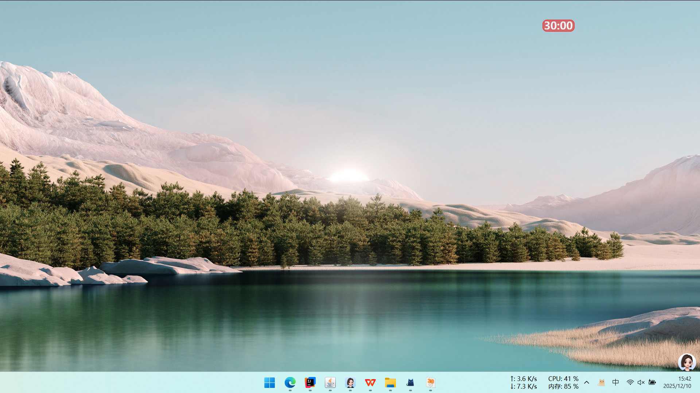

# ⌛ Focus30

Focus30 是一个使用 **JavaFX** 编写的专注倒计时应用。  
本项目通过 `Launch4j` 打包为 Windows 可执行文件，支持一键运行。



## ✨ 功能亮点
⏱️ 半透明悬浮倒计时窗口\
🌈 动态彩虹渐变特效\
🖱️ 支持拖拽、点击启动/重置

---

## 📂 项目结构

```
Focus30/
├─ imag/ # 存放图标和图片资源
├─ out/ # 编译输出目录，class、jar、exe文件
├─ src/ # Java 源代码目录
├─ .gitignore # Git 忽略文件配置
├─ Focus30.xml # Launch4j 配置文件
├─ README.md # 项目说明文件
└─ requirements.txt # 依赖或环境说明文件
```

---

## ▶️ 运行项目

1. 下载安装 **[Launch4j](https://pan.quark.cn/s/4d11acae2c5f#/list/share)** 。
2. 在配置中加载项目根目录下的 `focus30.xml` 文件。
3. 点击 **Build Wrapper** 按钮生成 `Focus30.exe` 可执行文件。
4. 生成完成后，双击运行 `Focus30.exe` 将显示一个悬浮的 **Focus30**。

