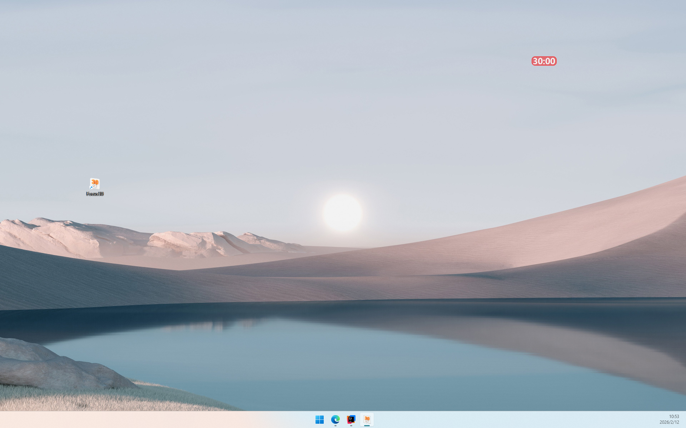

# ⌛ Focus30

Focus30 是一个使用 JavaFX 编写的30分钟倒计时应用，可在专注和放松之间自然切换。



---

## ✨ 功能亮点
⏱️ 半透明悬浮倒计时窗口\
🧠 专注 + 放松双阶段设计\
🌈 渐进式视觉反馈提醒\
🖱️ 支持拖拽、点击启动/重置\
🪶 轻量高效

---

## 🚀 快速开始

### 方式一：直接运行 EXE
下载 release 中的 `Focus30.exe`，双击即可运行。

### 方式二：源码运行
1. 克隆项目
2. 使用 IntelliJ IDEA 打开
3. 运行 MainLauncher 类

---

## 📂 项目结构
```
Focus30/
├─ src
│  ├── main
│  │   ├── java
│  │   │   └── com.focus30
│  │   │       ├── core      # 核心业务逻辑
│  │   │       ├── effect    # 特效/动画
│  │   │       ├── launcher  # 应用启动入口
│  │   │       ├── ui        # 界面相关
│  │   │       └── utils     # 工具类
│  │   ├── resources
│  │   │   ├── config        # 配置文件（可扩展设计）
│  │   │   └── imag          # 图片资源
├─ Focus30.xml               # Launch4j 配置文件
└─ tools                     # 如何编译、打包、运行、发行等说明
```

---
